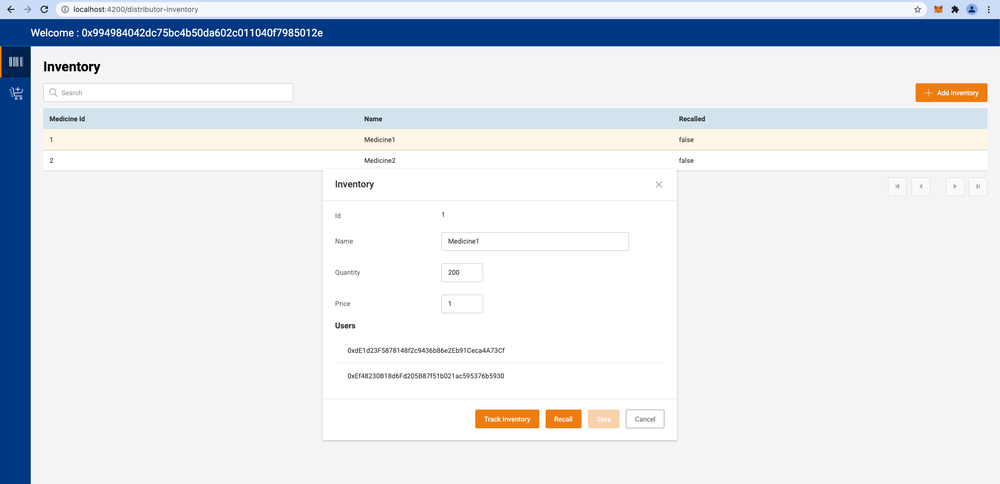

# Pharma-Supply-Chain

### Zip file contains the following files
- pharma-backend
- pharma-contract
- pharma-web
- README.md
- images-for-readme

 

### Architecture Diagram 

Components of the Design:
* pharma-contract
  * Used to deploy the contract on any network specified
* pharma-backen
  * Used to store information which is not needed in the blockchain
* pharma-web
  * Dapp which is used by the users for interactions with the smart contract and the backend 

 

### Sequence Diagrams

* High Level Sequence Diagram
    > 

* Owner adds new user
    > 

* Distributor adds medicine
    > 

* Retailer creates order
    > 

* Distributor confirms order
    > 

* Display Order Info
    > 

* Display Medicine Info
    > 

* Customer Places order
    > 

* Tracking and refund of medicines
    > 

 

### High Level explanation of flow

* Owners create two types of users Distributor/ Retailer. Customers need not be registered by the owner.
* Distributors will be able to add new medcines to their inventory and update them.
* Retailers will be allowed to select the different distrtibutors and create order for their respective medcines.
* Distributor can see the list of orders for them by all retailers, and will have to confirm the order for the transaction to take place.
* Once the Distributor confirms the order, only then the medicine will be added to the retailers list
* Retailer can update the cost of the medicine if needed.
* Customers will be allowed to select any retailer and their medicine, to place order based on the availability. Transaction is immediatly done and the data is updated accordingly in the smart contract.
* All users will have views to see the orders they have placed. (Distributor/ Retailer will also be able to see orders in their queue).
* Distributor will have access to see all the users who have any particular medicine. This can be helpful for tracking in case any medicine is to be recalled or see if anyone has got any side effects due to its usage.
* Distributors will also be allowed to recall the medicines, this removes the availability of the medicine from all sources (Distributor/Retailer) thus not allowing anyone else be able to place the order with it. Also the amount is transffered back to the respective users from the distributors balance. NOTE: If the retailer has increased the price of the medicine. The distributor will be paying that amount to the retailer instead of the previous price.

 

### Contract Diagram

   > 

 

### Latest Deployed address of smart contract
> 0x744Fc7094EA080593Bbb6D865A4e7bD591C46556

* Deployed Smart contract in remix
   > 

 

### Steps followed through UI

* User DashBoard
   > 

* Owner Registers Users (Distributor/ Retailer)
   > 

* Distributor Adding inventory
   > 

* Retailer Adding Order
   > 

* Distributor Confirming Order
   > 

* Retailer/Distributor can see Order Info
   > 

* Retailer can see his medicines after order confirmed
   > 

* Customer Creates Order
   > 

* Retailer can see Customer placed orders
   > 

* Distributor Track Medicines
   > 

* Distributor Recalled Medicines
   > 

* Toaster Message Shown after contract function executed
   > 

 

### Stack used:
- pharma-web: Angular 9
- pharma-backend: Python, flask
- Database: MongoDb
- Smart Contract: Solidity
- pharma-contract: truffle

 

### Steps To run application

* Add your secret key (12 word nmemonic) by creating a .secret file, in the pharma-contract folder
* run the following commands to deploy the smart contract
    > truffle compile
     
    > truffle migrate --network ropsten
* Take the latest contract address from the build/PharmaContract file and add it in pharma-web/src/abi.ts file
* Add the owner address in the file pharma-backend/config.json (the first address of your accounts is considered as owner while deploying it)
* Update the Database connection string for mongodb in pharma-backend/config.json
* Run the following command to start the backend in pharma-backend folder
    > python3 pharma-backend.py
* To run the web application, run the following commands.
    > npm i
     
    > npm start
* You will be able to access the dapp on http://localhost:4200
